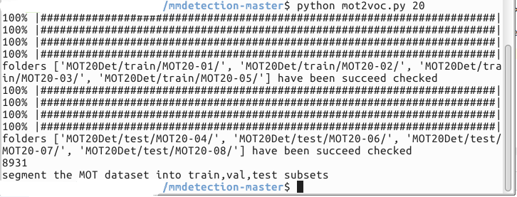

# MOT to VOC

**Function**: For research purpose, we create this project for others to simplify 
tranform the MOT17Det and MOT20Det to VOC format so that can be easily used in detection task.
 
We also press the Implementation details on [Zhihu](https://zhuanlan.zhihu.com/p/265984636).


## Introduction

The master branch works with python 3.5+.




## Installation
get into ./mmdetection and download MOT dataset and place into ./mmdetection
```shell
# into mmdetection folder
cd mmdetection-master

# transform mot17 to voc format
python mot2voc.py 17

# transform mot20 to voc format
python mot2voc.py 20
```

## Get Started

```shell
# git clone
git clone https://github.com/PanXF-HUST/mot2voc.git


Refer to the example to place the file and run
```

## Folder
```
data/
  MOT{17，20}/
    VOC2007/
      Annotations/
      ImageSets/
        train_all.txt
        test_all.txt
        Main/
          train.txt
          val.txt
          test.txt
            
      # train.txt or val.txt, if you use these splits
      JPEGImages/

MOT{17,20}Det/
  train/
    MOT{17,20}-01/
      gt.txt
      img1
    ...
  test/
    MOT{17,20}-01/
      img1
```

